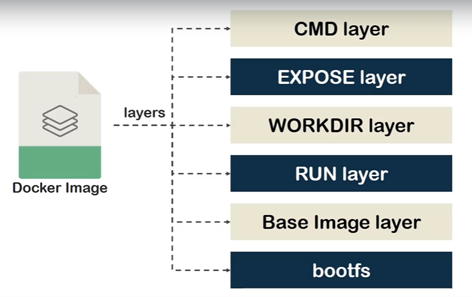

# Introduction to Docker Images
* A stack of multiple layers from Dockerfile instructions.
* Each layer apart from the top one is R/O
* The top layer is R/W type
* Recognized by name or Image ID 
* They can be push and pull from Docker Hub.

## Layer


## Docker Hub 
We need to create a free account to use the Docker Hub. 


### Repositories
We can navigate through repositories or create a new one. 

### Explore
We can explore all the repositories already created by the community. 

## Docker useful commands
### Search
```sh
docker search python:3.6
```
You don't need to have an account to search for images. 

```sh
docker search registry
```

Provides information about the official images:

```sh
docker search --filter "is-official=true" registry 
```

Formatting the results:
```sh
docker search --format "table {{.Name}}\t{{.Description}}\t{{.IsOfficial}}" registry
```

### List

List of images currently in our host:
```sh
docker image ls
docker images
```

List all of our images related to a name:
```sh
docker images ubuntu
```

We can narrow down the list using the version:
```sh
docker images ubuntu:16.04
```

### Pull
It pulls the specified image:
```sh
docker image pull nginx:latest
```

> 💡 The 'latest' tag makes Docker Engine download the latest version of the image. 

You can download other type of image, for example, the Alpine-based version of nginx which is minimized.
```sh
docker image pull nginx:alpine
```

If we want all the variants of an image (for testing purposes):
```sh
docker image pull --all-tags nginx
```

### Push
We can create repository, and push images to that repository.

First we need to go to Repositories and click on Create Repository

In order to access Docker Hub from console:
```sh
docker login
```

Then we will tag a image to our repository image:
```sh
docker tag nginx:latest mdgdevdocker/repo-nginx:mdg-nginx
```

After that, we can push our image to our repository:
```sh
docker image push mdgdevdocker/repo-nginx:mdg-nginx
```


