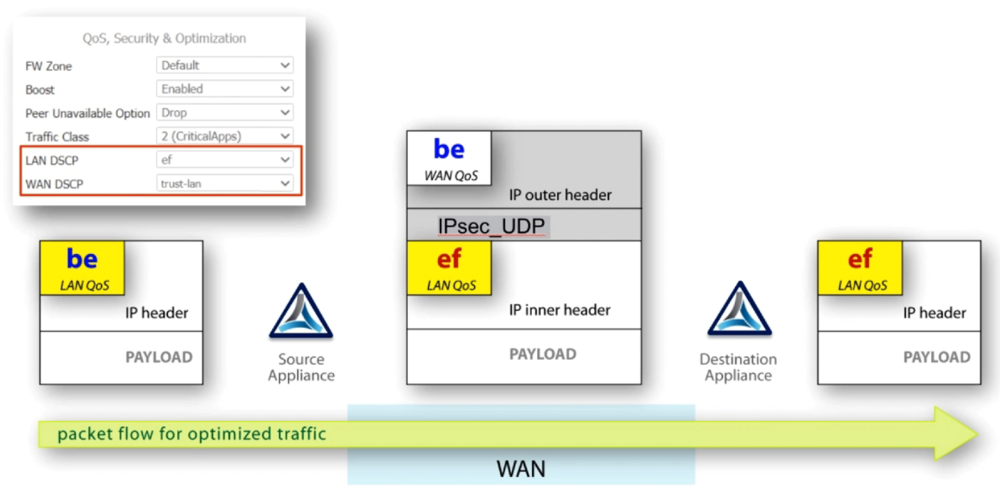
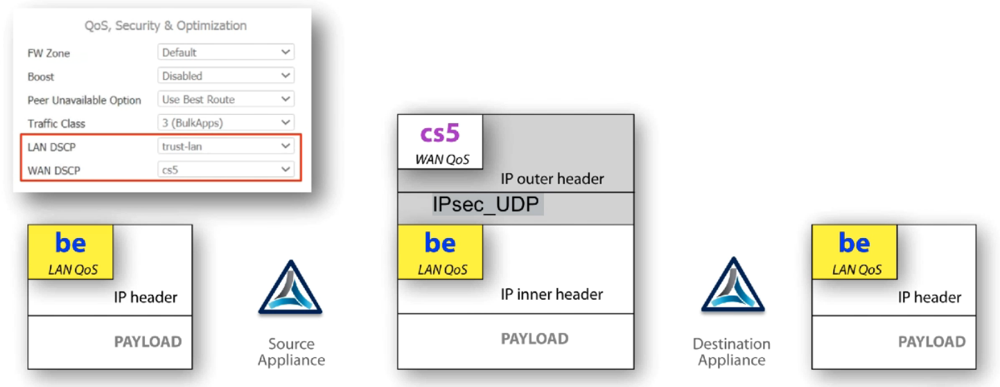
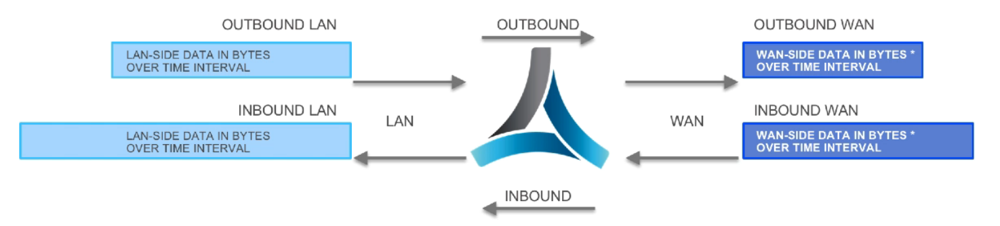
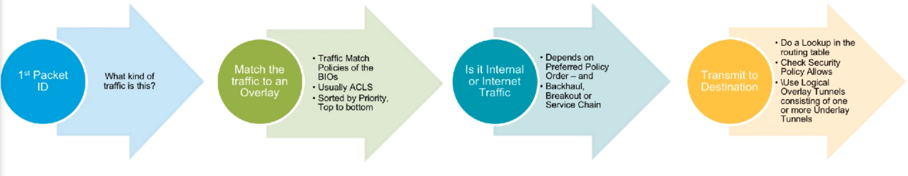

# Silver Peak Course: Deploying SDWAN Technologies - DST  


# Business Intent Overlays
Two types of tunnels to route the data:
1. **Underlays**: Using the physical connection. One tunnel per connection.
2. **Overlays**: Using one or more underlay tunnels. Logical tunnel. Treated as unique link. Logical

## Traffic Handling Features (Silver Peak)
### Path conditioning
1. **Forward Error Correction**
2. **Packet Order Correction**

### Dynamic Path Control (DPC)
Dyanically select the appropriate underlay tunnel with a BIO's Link Bonding policy

### BOOST 
WAN optimization technologies. 
* **TCP Acceleration**: Optimizes the TCP protocol to mitigate the effects of latency. 
* **Network Memory**: Deduplicates transmitted data to reduce congestion. 


## Dynamic Path Control and Link Bonding 
Controlled on a per Overlay basis by configuration options called:
**Link Bonding Policies**:
* FEC
* Quality
  * Loss
  * Latency
  * Jitter
  * Mean Opinion Score (MOS)
* Load-Balance

Group of technologies that Silver Peak uses to select best path. 

## Path Conditioning
Packet Loss and Packet Out of Order are issues that must be handled by the endpoint.

Affects Video and Audio connections. 
Commonly seen on shared infraestructure links such as MPLS or Internet Based IP VPNs. 

## Boost 
Boost components:
* Overcome Latency ➡ **TCP Acceleration**
  * Window scaling
  * Selective akcnowledgement
  * Round Trip Time Measurement 
  * High Speed TCP 

    With TCP Acceleration, the transmitting device experiences only LAN latency, using a TCP Proxy in Silver Peak appliance.

    TCP Accelearation REQUIRES **symmetric flows.**

* Reduce Congestion ➡ **Network Memory**
  * Deduplication
    * Does not work if the data is encrypted.
  * Compression (LZ compression)

# Silver Peak Network Elements
## Cloud Portal
All licenses are managed by the Portal. No customer action required.
## Orchestrator
Management software for Silver Peak devices. 
Must register with Cloud Portal. Required for EdgeConnect appliance registration approval.
## Edge Connect
Appliances.

Must register with Cloud Portal to operate. Crate network connections and move data as directed by Orchestrator. Devices must reregister with Portal periodically. 

The licensing can be done through Orchestrator if EdgeConnect devices have no direct Internet connection. 

Orchestrator can act as a proxy server. 


# Path Selection
## Subnet Sharing 
Used between appliances to advertise to each other through tunnels (like routing protocol):
* Directly attached.
* Manually added static.
* Subnets learned via a routing protocol. 


## Routing Protocols
* Silver Peak 
* BGP
* OSPF

## Routes table
Redistribution
* Configurable globally per protocol
* Configurable per route per static routes. 

## Management Routes
Separate from data path routes. 

# Deployment 

## Deployment Types
Two types of deployment of Silver Peak appliances:
### ILRM: Inline Router Mode
✅ Recommended (Best Practice)

All traffic must physically flow through appliance.

### OPRM: Out of Path Router Mode
L3 router or switch must redirect packets to appliance

## Deployment Modes
### Router Mode
✅ Recommended

Easiest mode to deploy:
* At least **two interfaces**: IP address & next-hop
* Data path between two or more different subnets.
* Flexible interfasce deployment options: Stateful firewall, ZBF
* Appliances can be managed via data path interfaces.
* Incoming LAN traffic: placed in any tunnel or sent direct-to-net. 

#### Types of deployment
1. Traditional HA
2. Edge High Availability (HA)
   1. Appliance Clustering
   2. Reduces Capex/Opex

#### Router Mode - Out of Path 
When ILRM is NOT possible. 

Traffic redirection is REQUIRED. 

### Bridge Mode
- LAN & WAN Interface Pairs: form a BRIDGE.
- Each pair is a BVI: Bridge Virtual Interface: One IP Address per BVI. 
- Stateful FW supported.
- ZBZ not supported 
- In bypass, appliance looks like crossover cable. 
- No EdgeHA mode

### Server Mode 
- Out of path ONLY
- Only one interface: mgmt0
- One IP addres
- No Firewall
- Traffic has to be redirected to the appliance. 

# Data Security 
## WAN Interface Firewall Modes
- FW Mode: Allow All
- FW Mode: Harden (Default) ⭕
- FW Mode: Stateful. Simple L3/L4 functionality. 
  - Not an IDS/IPS & not L7 content inspection. 
- FW Mode: Stateful + SNAT:
  - SNAT Applied outbound to Passthrough traffic only
  - Source address will be NAT

## Inbound Port Forwarding
Allow WAN-side devices to connect inbound to LAN-side. 

## Zone Based Firewall
- Assing interfaces and BIO's to zones
- Create Labels for each Zone
- Apply labels to interfaces/BIO
- Matrix to create ACL based on rules permit/deny 
- Intra-zone traffic **always allowed**.

## Encryption
- Data encryption:
  - Disk Encryption: 128 bit AES
  - IPSec_UDP: 256 bit AES

- SSL/TLS
  - Use the Key 
  - Re-Encrypts 
  - ❗ **REQUIRED FOR DEDUPLICATION**

# Configuration Overview
## Labels
- Identifiers to be applied to interfacs.
- Orchestrator will treat interfaces with the same labels in the same way.

## Deployment Profiles
- Configuration templates.
- Does NOT contain IP addresses.
- Can be applied to each appliance.

## Business Intent Overlays
- Configuration templates Orchestrator uses to dynamically create the overlay network. 
- Define which interfaces at each site should be connected based on the labels.
- LAN traffic - WAN Traffic associations based on the labels. 

---
## Order of operations
1. Design and Prepare
   - Obtain/create topology diagrams.
   - Know link speeds.
   - Understand firewalls and NAT/PAT in use.
   - Decide which traffic should be routed to which sites over shich underlay link types.
   - Indetify any hub sites.
2. Install and Licenses Orchestrator
3. Configure Orchestrator.
  - Create Labels
  - Create BIO
  - Create ACLs and other required configuration templates
  - Create Deployment Profiles for type of sites.
4. Install Appliances 
  - Register appliances with the Cloud Portal
  - Approve the appliances in Orchestrator.


## Interface Labels

* Two Types: LAN and WAN labels. 
  * LAN labels: Tagging -> alows to send traffic to a particular BIO.
  * WAN labels: Identify the newtork service the WAN interface will connect to. 
* Labels are completely arbitrary. 
  * Arbitrary 
  * Create as much as you need. 
* Default labels are cerated for you. 

## Deployment Profiles
* A template: appliance configuration
  * Interface Labels
  * FW settings/interface
  * WAN Link speeds & Max WAN BW
  * VLAN numbers
  * NAT flag 
  * Stateful & ZBF (Zone Based Firewall)

* **Does not include IP addresses**
* Multiple deployment profiles

## Using Templates
Useful tools for configuring appliance in more automated process. 
* Simplifies and automates the application of new/updated configuration.
* Saves Time
* Guarantees consistency
* Reduces Risk
  
### Common Terms
* **Template**: A group of configuration settings that control the behavior of a feature or set of features. 
* **Template Group:** A collection of templates used to configure settings on one or more appliances. 

**Note**: Replace or Merge as options whenever you update the configuration. 

## Business Intent Overlays 
Row for each overlay.

Overlay Configuration Options:


### SD-WAN Traffic to Internal Subnets
* Subnets
* Interfaces
* Regions
* FW Zones
* Boost
* QoS

### Breakout traffic to Internet & Cloud Services
For traffic not being sent over the SD-WAN fabric. 

## Traffic Access Policy 
Determining which traffic is sent to which BIO 
1. Overlay ACLs
2. **Appliance ACLs:** map different types of traffic to different overlay networks.
3. **LAN port labels** map all traffic on matching ports to an overlay network. There must be a local LAN interface/subinterface with a matching label. 

! **One Label or one ACL per overlay.**

## Wildcards in ACLs
* Three different wildcards supported
  * '|' Pipe ▶ OR
  * '*' Asterisk ▶ Any
  * '-' Dash ▶ Range

## Topology and Regions
### Topology
* Each BIO has topology type:
  * Mesh: Tunnel between devices
  * Hub & Spoke: Tunnel between hub and spokes.
  * Regional Mesh
  * Regional Hub & Spoke

### Hubs
* Connect to spokes and each other
* Advertise routes to spokes and each other
* Hub in all overlays

### Regions
* Connect groups of appliances via one or more hubs.
* Reduces the overall number of tunnels needed.
* Spokes: connect through hubs in their local region. 

>> Each overlay have different configuration for each Region.


>> Increases the number of available BIOs

>> Device not in a region defined: Global Region 

## Underlay WAN links to use for the Overlay

* Primary
  * Choose one or more primary networks
  * Traffic sent unless blackout (link down) or brownout (performance threshold)

* Backup
  * Used in case of blackout/brownout
  * Choose one or more networks


### Cross connect groups
Add each interface label to a cross connect group.

Orchestrator will only attempt to build cross connect tunnels with interfaces **in the same Cross Connect Group**.

Configurable per BIO. 

### Secondary Connections
Failover between primary and Backup. 

Backups will only be used if Secondaries also fail. 

### SLO: Service Level Objective
| SLO | Description |
| ----- | ----- | 
| Loss | Packets don't reach their destination (pre-FEC) |
| Latency | ms does it take a packet to arrive | 
| Jitter | Packet-to-Packet timing arrival variation | 


Values are OR: only **ONE** need to exceed. 

Two primary ➡ One marked down if exceeds the thresholds.

## Link Bonding and Failover
Resiliency against WAN Link failure.


Logically bonded. 

### Link Bonding Policies
| Policy | Tag | Description | 
| ------ | ----------- | ---- |
| High Availability | HA |  1:1 FEC ratio. Better than mirroring. Instantaneous failover. 2 best quality links will be in us at a time. |
| High Quality | HQ | >80% BW efficiency on the actie link. 1:5 variable auto FEC. Best path. 100% for the best path and FEC on 2nd best path | 
| High Throughput | HT | Load Balances between paths (round robin). Two active links for LB. Fills path with most BW avail. until BW is = 1:5 variable FEC. | 
| High Effiency | HE | Similar to HT. No overhead from FEC. LB (round robin). Exposure to loss. Two active links for LB. Fills path based on % utilization: least % utilized first. | 
| Custom | - | FEC wait Time. Path conditioning. Link selection | 


### Different policy settings for hubs & spokes.
Uncheck use branch settings: settings for the hub will be different. 


## Firewall Zone 
* Each BIO: Zone Based Firewall (ZBF)
* Traffic moving between devices in the same zone: always permitted. 

## Boost License
Assumes ther is licensed Boost bandwidth available.

## Peer Unavailable Option
Case there is no destination overlay tunnel avilable. 

* Use XXX
* Use Best Route
* Drop

## QoS Settings
* Which QoS traffic class will be placed in
* Set DSCP settings for payload (LAN) and Tunnel (WAN)
* All overaly traffic ➡ default global shaper 
  

## Application-Drive security policies for breakout 
* First-packet IQ: granular Local Internt Breakout (direct to net)
  * Trusted Business Apps
  * Home from Work Apps
  * Untrusted

## Breakout traffic to Internet & Cloud Services
* Link selection
* Set policies and order
* Internet reachability testing. 

When to stop using a link and how to failover:
* Waterfall
* Balanced
* Use Loss, Latency and Jitter.
* Choose measurements. 

## Overlay List Order = PRIORITYU
Priority column determines the order of matching top ➡ down. 

Top overlay = highest priority. 

BIO configuration causes the Orchestrator to create Route Policies on appliances.

Optimization and QoS policies are also created. 


# Automated provisioning and configuration
## Zero Touch Provisioning (ZTP) > plug & play.
* Device gets IP/DNS via DHCP.
* Device registers itself with Cloud Portal: Pending Approval status
*  Connects to Orchestrator and checks SN. 
*  Admin approves registration in Orch. and added to a group. 

## EC - New Virtual Device Registration 
* Configure new VD: Provide account name + Account Key 
* Virtual Dev registers itself with Portal 
* Portal contacts Orch. and provides IP + SN
* Admin approves 

## Preconfiguration of Appliances
### ZTC: Zero Touch Configuration
* Create preconfig
* Set-up auto-approval & config
* Work with ZTP or VMs
* Use YAML files 

# Virtual Router Redundancy Protocol (VRRP)
* Redundant Gateway functionalty
  * L2 protocol. 
  * Automatic assignment of available IP routers to participating hosts. 
* Operates with a single subnet

## VRRP Use Cases
* Edge HA
* Traditional HA

Out-of-path One Silver Peak works with VRRP

Useful with two SP devices share a Virtual IP address.

## Hybrid Approach
End devices and VRRP VIP in different subnets. 

PBR redirects traffic to VIP 

### Configuration
* Configuration > VRRP 
* Required
  * Group ID
  * Interface
  * VIP 

* Preemption 

# Quality of Service (QoS)
1. QoS Policy
   1. Traffic class
   2. DSCP
2. Shaper
   1. Behavior of individual traffic classes, priorities and limits. 

## Max Bandwidth
Limits appliance throughput and shaper BW allocation. 

Set by admin. 

## Deployment Profile
Total Inbound and Outbound BW 

## Traffic Class Management in the Shaper 
Defined in the Shaper

10 classes

Classes ar prioritized: lower number > get BW first. 

Sensitive traffic > High priority.

## Shaper Operation Summary
### Basic Rules
* Priority order: give all calsses their guarantee (Min BW)
* Data in any class & available BW > Weighted round-robin (Excess Weighting)

---
* Max WAN BW
* No class can exceeds its Max BW
* No flow can exceed the Rate Limit for its Traffic Class
* Drop any packets which exceeds Max Wait Time in the queue. 

## Trafic Class Minimums
Must be set carefully. 

Recommendation: Set MIN BW to 0 to use weighted priority. 


## DSCP - TRUST/TRUST
Use the same DSCP for internal/external 

## DSCP - EF/TRUST-LAN
LAN: EF

WAN: TRUST-LAN 

The tunnel uses the LAN DSCP to encapsulate the packet through the tunnel, putting EF DSCP for the encapsulated packet. 



## DSCP - TRUST / CS5
LAN: Trust-LAN

WAN: CS5

The opposite behavior. The LAN remains with the same tag, but the Tunnel traffic is tagged as CS5.



**Note:** Security Policies are applied in the end, once the egress zone is determined. 

# Backup, Restore, Image Management
Maintenance > Backup Appliances


* Appliances configurations are backed up to the Orchestrator database
* Orchestrator configuration and database are backed up to another server. 


>> Backups can be scheduled to occur on a regular basis. 


* Orchestrator Restore: using CLI 
* Appliance Restore: Once at a time. 
* RMA Wizard 

# Monitoring your Network 
## Health Map
Hourly graphic view of state of Loss, Latency, Jitter & Alarms per appliance.

Each box: 1 hour.

## Network View on Appliance
* BW usage
* Top Apps
* Latency
* Loss
* Top Flows

----
Selectable:
* Traffic Type
* Direction
* Time Period
* Tunnel 

### Inbound Traffic
Comes FROM the WAN

### Outbound Traffic
Goes towards the WAN



## Flow Monitoring
Current flows in real time. 

Flow Table: Flow Details > Flow Statistics. 

## Bandwidth 
BW usage

LAN/WAN/Ratio

Ratio between LAN and WAN: reduction ratio. 

## LOSS
Packet loss. 

* PRE-FEC-Loss: Actual Loss
* POST-FEC-Loss: Effective Loss. 

## Charts
Selectable time period up to 30 days. 

## Realtime Charts 
Three second intervals. 

## Appliance Charting from Orchestrator 
Support > [Reporting] Appliance Charts

## Configuring Reports - Orchestrator
Define custom reports on Reports tab

# Logging 
## Orchestrator Specific
* Audit Logs
* Orchestrator Debug

## Appliance specific 
* Event Logging
* Alarm/Alert Logging
* Audit Logging
* Node

## Alarm Alerting
Emails

## Netflow/IPFIX
Is supported by Orchestrator.

Configured on the Orchestrator as a Template. 

Flow export. 

## Syslog
Appliance events sent directly to a logging servers. 

# Troubleshooting 
SilverPeak TAC

**Support > Technical Support** 

Genmerate Sys Dump

Generate Show Tech 

Directly upload files to Support. 

## Diagnostic Tools
### Ping and Traceroute 
Sent from mgmt0

```
ping -I <src addr> <dest addr>
ping -I <interface> <dest addr>
```

```
traceroute -s <source_address>
traceroute -i <interface>
```

### Iperf
Available in Orchestrator 

* Testing max throughput, jitter, latency
* Execute from the Orchestrator
  * Select 2 appliances
  * Link Integrity Test
* Can be executed from Appliance CLI (setup on eaech end)
* Do not unintentionally send it through the tunnel.

**Note:** All the BW is used. 

### Built in Packet Capture
Export and use in Wireshark, etc. 

Filtering

### CLI: show system capabilities

## Data Flow Summary 


## Boost and Asymmetry 
Traffic is bidirectional: inbound and outbound. 


